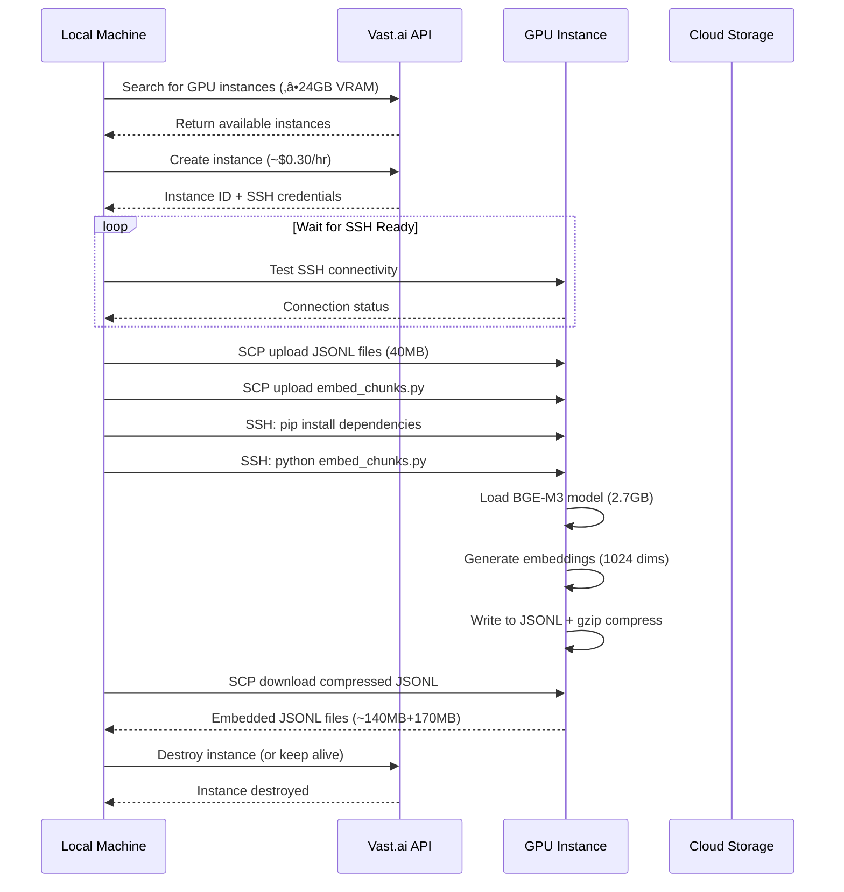
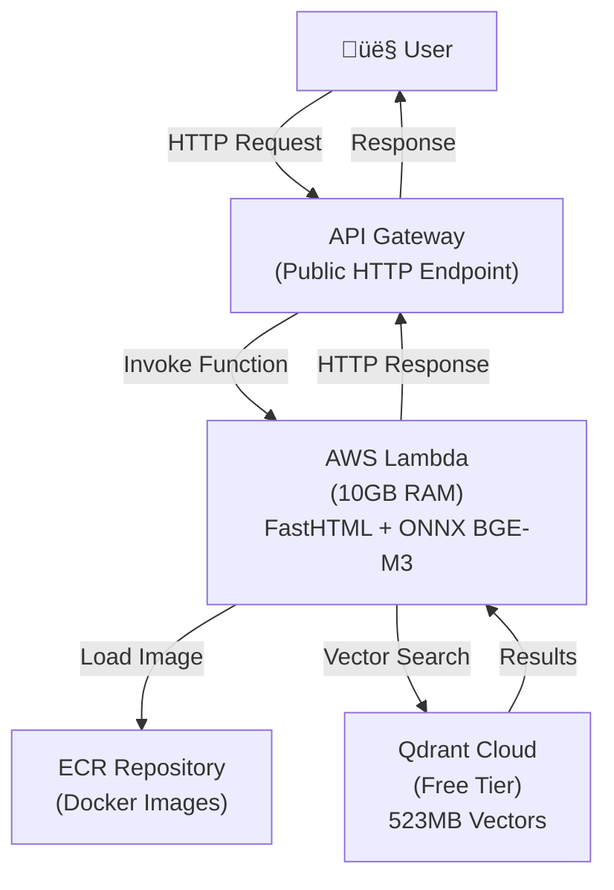

# Development Flow

This document tracks what we've built and the decisions made along the way.

## Project Overview

Building an agentic RAG system in French for labor law questions, combining:
- **Code du travail** (French labor code)
- **KALI corpus** (Convention collectives - e.g., Syntec for IT workers)

**Example question**: "What is my période d'essai préavis if I have worked more than a year and I'm in informatics (Syntec convention)?"

## Phase 0: Project Setup ✅

### Structure Created
```
admin-rag/
├── data/
│   ├── raw/           # Original Legifrance XML
│   ├── processed/     # Cleaned JSONL output
│   └── eval/          # Evaluation datasets
├── src/
│   ├── ingestion/     # Data extraction & processing
│   ├── retrieval/     # RAG components
│   ├── agents/        # Agentic layer
│   └── evaluation/    # Quality assessment
├── notebooks/         # Experiments
├── configs/           # Configuration
└── tests/
```

### Tech Stack
- **Dependency management**: Poetry
- **RAG framework**: Haystack 2.x
- **Data format**: XML → JSONL
- **Language**: Python 3.10+

## Phase 1: Data Pipeline (In Progress)

### 1.1 Understanding the Data ✅

**Raw data location**: `data/raw/code_travail_LEGITEXT000006072050/`

**Structure discovered**:
- 41,815 article XML files (`article/`)
- 10,567 section XML files (`section_ta/`)
- 2 texte files (root metadata)

**Key XML structure**:
```xml
<ARTICLE>
  <NUM>L6234-2</NUM>              <!-- Article number -->
  <ETAT>ABROGE</ETAT>             <!-- Status: VIGUEUR, MODIFIE, ABROGE -->
  <DATE_DEBUT>2018-04-15</DATE_DEBUT>
  <DATE_FIN>2019-01-01</DATE_FIN>
  <BLOC_TEXTUEL>
    <CONTENU>...</CONTENU>         <!-- Article text -->
  </BLOC_TEXTUEL>
  <CONTEXTE>
    <!-- Hierarchical structure: Partie > Livre > Titre > Chapitre -->
  </CONTEXTE>
</ARTICLE>
```

### 1.2 Section Metadata Enhancement ✅

**Decision**: Parse section files to enrich articles with section titles

**Why**: Section titles provide more specific context than generic hierarchy
- Example: "Paragraphe 3: Modalités particulières pour les travailleurs intérimaires"
- Better than just "Sous-section 2"

**Implementation**:
- `src/ingestion/parsers/section_parser.py` - Extracts section titles and article mappings
- Builds `article_id → section_title` mapping
- Output: `data/processed/article_to_section_mapping.json`

### 1.3 Article Parser ✅

**Implementation**: `src/ingestion/parsers/code_travail_parser.py`

**What it does**:
- Parses all 41,815 article XML files
- Filters out obsolete articles (`ETAT=ABROGE`)
- Extracts:
  - Article ID and number
  - Current state (VIGUEUR, MODIFIE)
  - Validity dates
  - Article text content
  - Hierarchical context (Partie, Livre, Titre, Chapitre)
  - Section title (from mapping)
- Output: `data/processed/code_travail_articles.jsonl`

**Article schema**:
```json
{
  "article_id": "LEGIARTI000036802200",
  "article_num": "L6234-2",
  "etat": "VIGUEUR",
  "date_debut": "2018-04-15",
  "date_fin": null,
  "text": "Le fait d'exercer des fonctions...",
  "hierarchy": {
    "partie": "Partie législative",
    "livre": "Livre II : L'apprentissage",
    "titre": "Titre III : Centres de formation...",
    "chapitre": "Chapitre IV : Dispositions pénales"
  },
  "section_title": "Paragraphe 3: Modalités particulières...",
  "source": "code_travail",
  "obsolete": false
}
```

### 1.4 Main Parsing Script ✅

**Implementation**: `src/ingestion/parse_code_travail.py`

**Workflow**:
1. Parse sections → build article-to-section mapping
2. Parse articles with section enrichment
3. Save to JSONL with full metadata

**To run**:
```bash
poetry run python src/ingestion/parse_code_travail.py
```

### 1.5 Fixing Duplicate Articles ✅

**Problem discovered**: Same article number appeared multiple times with different states:
- MODIFIE (historical versions with past `date_fin`)
- VIGUEUR (current version with `date_fin = "2999-01-01"`)

**Solution**: Filter to keep only current versions
- Keep articles where `date_fin == "2999-01-01"` or `date_fin is None`
- Removed 19,907 historical versions (keeping only 11,494 current articles)

**Results after fix**:
- 11,494 valid current articles (no duplicates)
- 30,321 filtered out (ABROGE + historical versions)
- 100% have section metadata

### 1.6 Article Length Analysis ✅

**Statistics on clean data**:
- Average article length: 91.5 tokens
- 99.1% (11,393) under 500 tokens
- 0.9% (101) need chunking
- Longest: 17,205 tokens

**Decision**: Only chunk the 0.9% that exceed 500 tokens

### 1.7 Chunking Implementation ✅

**Implementation**: `src/ingestion/chunkers/article_chunker.py`

**Strategy**:
- Articles < 500 tokens → keep as single chunk
- Articles ≥ 500 tokens → split by semantic boundaries:
  - Double newlines (paragraph breaks)
  - Numbered lists (1°, 2°, 3° common in French legal text)
  - Combine paragraphs until ~500 token limit
  - Never split mid-paragraph (preserve coherence)

**Output schema** (adds to article schema):
```json
{
  ...all article fields...,
  "chunk_id": "LEGIARTI000036802200_0",
  "chunk_index": 0,
  "total_chunks": 3,
  "is_chunked": true
}
```

**To run**:
```bash
poetry run python src/ingestion/chunkers/article_chunker.py
```

**Output**: `data/processed/code_travail_chunks.jsonl` (~11,600 chunks)

### 1.8 KALI Corpus Exploration ✅

**Data location**: `data/raw/kali/kali/global/`

**Structure discovered**: Identical to Code du travail
- 289,936 article XML files
- 105,871 section files
- 86,996 texte files (conventions)
- Uses `KALI` prefix instead of `LEGI`

**Key difference**: Articles belong to conventions identified by IDCC numbers
- Found via `<CONTENEUR nature="IDCC" num="1486">` in article XML
- Each IDCC = one convention collective

**Decision**: Parse top 10 conventions by sector importance instead of just Syntec

### 1.9 KALI Parser Implementation ✅

**Implementation**: `src/ingestion/parsers/kali_parser.py`

**Target conventions** (top 10 by sector):
| IDCC | Convention | Sector |
|------|------------|--------|
| 3248 | Métallurgie | Metal/tech industries |
| 1486 | Syntec | IT services, consulting, engineering |
| 1979 | HCR | Hotels, cafés, restaurants |
| 1597 | Bâtiment | Construction (10+ employees) |
| 1090 | Automobile | Auto services, repair shops |
| 2216 | Commerce alimentaire | Food retail |
| 0016 | Transports routiers | Road transport |
| 0044 | Industries chimiques | Chemical industries |
| 2120 | Banque | Banking |
| 0573 | Commerces de gros | Wholesale trade |

**Parser features**:
- Filters by IDCC numbers
- Removes obsolete articles (ABROGE, PERIME)
- Filters historical versions (keeps only date_fin = "2999-01-01")
- Extracts convention metadata (IDCC, convention name, title)
- Same structure as code_travail_parser

**Results**:
- **13,033 valid articles** from 7/10 conventions
- 276,903 filtered out (other conventions + obsolete)
- Breakdown:
  - Métallurgie (3248): 4,230 articles
  - Services automobile (1090): 3,363 articles
  - Bâtiment (1597): 1,782 articles
  - Syntec (1486): 1,045 articles
  - Banque (2120): 1,000 articles
  - Commerce alimentaire (2216): 992 articles
  - HCR (1979): 621 articles

**Missing conventions** (3/10): Transports routiers, Industries chimiques, Commerces de gros
- Likely different IDCC numbers or in non_vigueur folder

**To run**:
```bash
poetry run python src/ingestion/parsers/kali_parser.py
```

**Output**: `data/processed/kali_articles.jsonl`

### 1.10 KALI Chunking (Ready)

**Implementation**: Reuses `src/ingestion/chunkers/article_chunker.py`
- Same chunking logic as Code du travail
- Works on any JSONL with article structure

**Main script**: `src/ingestion/parse_kali.py`
- Parses KALI articles
- Chunks them automatically

**To run**:
```bash
poetry run python src/ingestion/parse_kali.py
```

**Output**: `data/processed/kali_chunks.jsonl`

### 1.11 KALI Chunking ✅

**Results**:
- 13,033 articles processed
- 96.1% (12,531) kept as-is
- 3.9% (502) chunked into multiple pieces
- **14,154 total chunks** output
- Saved to `data/processed/kali_chunks.jsonl`

### 1.12 AgentPublic/legi Dataset Exploration ✅

**Discovery**: HuggingFace dataset with pre-processed French legal corpus
- Dataset: `AgentPublic/legi` (1.26M legal document chunks)
- Pre-computed BGE-M3 embeddings (1024 dims)
- Parquet format with rich metadata

**Investigation results**:
- Scanned 1.26M records to find Code du travail
- Found **33,418 Code du travail chunks** (vs our 11,644)
- **Ratio: 2.9x more chunks** from same source data

**Their approach**:
- Fixed-window chunking: 5000 chars per chunk
- 250 char overlap between chunks
- Uses LangChain chunking utilities
- Extracts citation links (`<LIENS>` tags) as JSON
- Includes ministry, category, nota fields

**Our approach**:
- Semantic chunking: paragraph/numbered list boundaries
- ~500 tokens per chunk (~2000 chars)
- No overlap (cleaner citations)
- 99.1% of articles kept whole (only 0.9% chunked)
- Rich metadata: hierarchy + section titles

**Decision: Keep our processed data**

**Reasons**:
1. **Experimentation flexibility**: Can test different chunking strategies
2. **Semantic chunking**: Preserves legal structure better
3. **Richer metadata**: Hierarchy + section titles vs citations
4. **No overlap**: Cleaner for citations/attribution
5. **Simplicity**: Modern RAG favors simpler chunking

**What we adopt from them**:
- ✅ **BGE-M3 embedding model** (validated on French legal text)
- 📝 Future: Parse `<LIENS>` tags for article cross-references (Phase 5)

## Phase 1 Complete! ✅

**Final dataset:**
- Code du travail: **11,644 chunks**
- KALI (7 conventions): **14,154 chunks**
- **Total: 25,798 chunks**

### Data Pipeline Flow Diagram


### Architecture Decision: Separate Collections vs Merged Corpus

**Decision: Keep datasets SEPARATE for proper agent routing**

**Why NOT merge:**
- Agent needs explicit routing logic
- Query workflow: "Check Code du travail first, then query specific convention"
- Can compare rules side-by-side (hierarchy: convention ≥ Code du travail)
- Better observability (which source was queried?)

**Phase 2 approach:**
- Separate vector collections:
  - `code_travail` collection (11,644 chunks)
  - `kali_<idcc>` collections per convention (7 collections)
- Agent tools:
  - `retrieve_code_travail(query)`
  - `retrieve_convention(query, idcc)`
  - `identify_convention(job_role, industry)`

## Phase 2: Retrieval Foundation (In Progress)

### 2.1 Vector Store Setup ✅

**Decision: Qdrant**

**Why Qdrant:**
- Fast (Rust-based) and free (open source)
- Excellent metadata filtering (critical for multi-source RAG)
- Native collection support (separate code_travail/kali collections)
- Perfect scale for 26K vectors
- Good Haystack integration

**Setup:**
```bash
docker run -d -p 6333:6333 -p 6334:6334 \
  -v $(pwd)/qdrant_storage:/qdrant/storage:z \
  --name qdrant qdrant/qdrant
```

**Running at**: `http://localhost:6333`
**Dashboard**: `http://localhost:6333/dashboard`

### 2.2 Embedding Model Selection ✅

**Decision: BGE-M3** (BAAI/bge-m3)

**Why BGE-M3:**
- Validated by AgentPublic/legi on French legal text
- Multilingual support (excellent French performance)
- 1024 dimensions (good balance of quality/size)
- Sentence-transformers compatible

**Dependencies installed:**
- `qdrant-haystack` (4.2.0)
- `sentence-transformers` (3.4.1)
- `torch` (2.9.1) + `transformers` (4.57.3)

### 2.3 Ingestion Pipeline ✅

**Implementation**: `src/retrieval/ingest_code_travail.py`

**Pipeline architecture:**
1. Load chunks from JSONL
2. Convert to Haystack Documents with rich metadata
3. Generate BGE-M3 embeddings (auto-detects GPU/CPU)
4. Index into Qdrant collection

**Metadata preserved:**
- Article identifiers (article_id, article_num)
- Status (etat, dates)
- Hierarchy (partie, livre, titre, chapitre)
- Section titles
- Chunk information (for multi-chunk articles)
- Source identifier

**Collections:**
- `code_travail`: 11,644 chunks (script: `ingest_code_travail.py`)
- `kali`: 14,154 chunks (script: `ingest_kali.py`)

### Ingestion Pipeline Architecture Diagram


### 2.4 Pipeline Automation ✅

**Implementation**: `Makefile`

**Purpose**: Simplify reproduction and deployment

**Why Makefile (not Airflow/Prefect)?**
- Pipeline runs once or infrequently (not scheduled)
- Linear dependencies (no complex DAG)
- Small scale (26K documents)
- No need for orchestration overhead

**Key targets:**
```bash
make all      # Full pipeline: setup → parse → ingest
make setup    # Install deps + start Qdrant
make parse    # Phase 1: XML → JSONL
make ingest   # Phase 2: Embed → Qdrant
make status   # Check pipeline status
```

**Benefits:**
- One-command reproduction on new machines
- Clear documentation of dependencies
- Built-in error checking (data presence, Qdrant status)
- Clean separation of phases

**Key target: `make ingest-only`**
- Ingests from existing JSONL files (skips parsing)
- No raw XML data needed (only 40MB JSONL vs 10GB XML)
- Perfect for cloud GPU instances or moving between machines
- Enables testing different embedding models without re-parsing

### 2.5 Vast.ai Automation ✅

**Challenge**: Local GPU insufficient for BGE-M3 embedding generation (requires 24GB VRAM)

**Solution**: Automated vast.ai workflow for cloud GPU embedding

**Implementation**: `scripts/run_vast_ingestion.py`

**Workflow**:
1. Search for GPU instances (≥24GB VRAM, good dlperf score)
2. Provision instance (~$0.20-0.50/hr)
3. Upload JSONL files + embedding script
4. Generate BGE-M3 embeddings on GPU
5. Compress and download embedded JSONL files
6. Destroy instance (or keep alive for testing)

**Architecture decision: Simplified embedding-only workflow**
- **Problem**: Docker-in-Docker complexity, private repo access
- **Solution**: Upload `embed_chunks.py` directly, no git clone needed
- **Benefits**: Faster setup, lower costs (gzip compression), no GitHub required

**Key learnings**:
- Use `dlperf` (tested) not `inet_down` (self-reported, often fake)
- Sort by `score` (ML performance) not just price
- SSH connectivity testing required (status "running" ≠ SSH ready)
- SCP uses `-P` (uppercase), SSH uses `-p` (lowercase)
- PyTorch in Docker images may need upgrading for compatibility

**Files created**:
- `scripts/embed_chunks.py` - Standalone embedding generator
- `scripts/run_vast_ingestion.py` - Full automation
- Updated ingestion scripts to detect pre-computed embeddings

**Cost**: ~$0.10-0.30 for full embedding generation (25,798 chunks)

### Vast.ai Automation Workflow Diagram



### 2.6 Embedding Generation & Indexing ✅

**Embeddings generated on vast.ai:**
- Model: BAAI/bge-m3 (1024 dimensions)
- GPU: 24GB VRAM instances (RTX 3090/4090 class)
- Time: ~15-20 minutes for 25,798 chunks
- Size: ~140MB (code_travail) + ~170MB (kali) with embeddings

**Local indexing:**
- Detected pre-computed embeddings in JSONL
- Skipped embedding step (just load + write to Qdrant)
- Time: ~2 minutes total (fast, CPU-bound)

**Collections created:**
- `code_travail`: 11,644 chunks with BGE-M3 embeddings
- `kali`: 14,154 chunks with BGE-M3 embeddings
- **Total: 25,798 vectors indexed in Qdrant**

**Qdrant dashboard**: `http://localhost:6333/dashboard`

### 2.7 Data Quality Observations

**Chunking analysis:**
- Code du travail: 60% <500 chars (short articles), mean 587 chars
- KALI: 46% <500 chars, mean 1130 chars
- 175 empty chunks in KALI (1.2% - parsing failures)
- 7 oversized chunks in code_travail (>8000 chars - annexes with tables)
- 278 oversized chunks in KALI (2%)

**Decision**: Proceed with current chunking, refactor if retrieval quality suffers
- Can always re-chunk and re-embed later
- Most chunks are reasonable size
- Issues affect <3% of data
- Better to validate with real queries first

**Future improvements**:
- Parent-child chunking for tiny articles
- Better annex handling (tables, lists)
- Filter empty chunks before embedding

## Phase 2 Complete! ✅

**Achievements:**
- ✅ Qdrant vector store running locally
- ✅ BGE-M3 embeddings generated (25,798 chunks)
- ✅ All data indexed with rich metadata
- ✅ Vast.ai automation for GPU embedding
- ✅ Pre-computed embedding detection in pipelines
- ✅ Makefile automation for reproducibility

**Ready for Phase 3**: Build retrieval pipeline and test with labor law queries

## Phase 3: Retrieval Pipeline ✅

**Completed:**
- ✅ Built BM25 retrieval pipeline (no embeddings needed locally)
- ✅ Created FastHTML web UI for testing
- ✅ Implemented metadata filtering (by IDCC, collection)
- ✅ Tested with sample labor law queries

**Key decisions:**
- BM25 keyword search for local development (no GPU needed)
- Embedding via external API (Cohere/HF) for inference
- Pre-computed BGE-M3 embeddings in Qdrant for semantic search later

## Phase 3b: Infrastructure & Deployment (In Progress)

### Architecture Decision Evolution

**Budget:** €75 for 3 months (~€25/month)

#### Testing Phase: ONNX BGE-M3 int8 Performance ✅

**Model tested:** `gpahal/bge-m3-onnx-int8` (quantized int8 ONNX model)

**Results:**
- Model size: ~700MB (fits Lambda)
- Cold start: 4.99s (model load + tokenizer)
- Warm query: **0.06s** (60ms!) ✅
- Embeddings confirmed: 1024-dim dense vectors
- Quality: int8 quantization (~1-2% accuracy loss, acceptable for demo)

**Key insight:** CPU inference with ONNX int8 is **fast enough** for production UI.

**Dependencies:** `optimum[onnxruntime]` + `transformers`

#### Final Architecture: AWS Lambda + Qdrant Cloud (Serverless)

**Tech stack:**
- **Compute**: AWS Lambda (10GB RAM) - FastHTML web app + BGE-M3 ONNX inference
- **Vector DB**: Qdrant Cloud free tier (523MB vector storage, fits 25,798 docs)
- **Web framework**: FastHTML (Python)
- **Embeddings**: BGE-M3 ONNX int8 model (local in Lambda, 60ms latency)
- **IaC**: Terraform (learn AWS Lambda + serverless infrastructure)

**Why Lambda over EC2:**
- True serverless: €0 for bursty/low traffic (free tier: 1M requests/month)
- Auto-scales: Multiple concurrent users = parallel Lambda instances
- Fast warm latency: 60ms query embedding (vs 5-8s on EC2 t4g.small CPU)
- Qdrant Cloud free tier: 523MB fits our data perfectly

**Why this beats EC2:**
- EC2 t4g.small CPU: 5-8s embedding time (too slow for demo)
- Lambda with ONNX int8: 0.06s embedding time (production-ready)
- Cost: €0 vs €10/month
- Complexity: Similar (Terraform for both)

**Deployment flow:**
1. Terraform provisions Lambda function, IAM roles, API Gateway
2. Package Lambda: Docker image with FastHTML + ONNX model + dependencies
3. Deploy to Lambda with 10GB RAM allocation
4. Qdrant Cloud: Create free tier cluster, upload vectors
5. Web app: Query → Lambda embeds → Qdrant Cloud searches → results

### Infrastructure Architecture Diagram



### Terraform Files Dependency Diagram


**Monthly cost breakdown:**
- Lambda: €0 (free tier, bursty traffic)
- Qdrant Cloud: €0 (free tier, 523MB < 1GB limit)
- API Gateway: €0 (free tier, <1M requests/month)
- **Total: €0/month** (leaves full budget for agentic layer)

**Trade-offs:**
- Cold starts: First query takes 5s (acceptable, just warm up before demo)
- Vendor lock-in: Tied to AWS Lambda + Qdrant Cloud
- Benefits: €0 cost, fast queries, auto-scaling, production-ready latency

**Next phase:** Agentic layer with Claude/Mistral API (€25/month budget available)

## Phase 3b: Infrastructure & Deployment ✅

### 3b.1 Qdrant Configuration System ✅

**Implementation**: `config/qdrant_config.json`

**Feature**: Unified config supporting both local and cloud Qdrant

**Config structure**:
```json
{
  "type": "cloud",  // or "local"
  "cloud": {
    "url": "https://...",
    "api_key": "..."
  },
  "local": {
    "url": "http://localhost:6333",
    "api_key": null
  }
}
```

**Benefits**:
- Single config file, easy switching between environments
- No code changes needed (just edit config)
- Supports credentials management
- Works with both ingestion and retrieval

### 3b.2 Updated Ingestion Scripts ✅

**Changes**:
- `src/retrieval/ingest_code_travail.py`: Now reads config, supports cloud/local
- `src/retrieval/ingest_kali.py`: Same improvements
- Both auto-detect config type and print which Qdrant being used

**New function**: `load_qdrant_config()`
- Reads from `config/qdrant_config.json`
- Returns config dict with URL and API key
- Used in `create_qdrant_store()` function

### 3b.3 Semantic Search Retrieval ✅

**Implementation**: `src/retrieval/retrieve.py` rewritten

**Key changes**:
- Switched from BM25 (keyword) to semantic search (embeddings)
- Now uses `QdrantEmbeddingRetriever` instead of `InMemoryBM25Retriever`
- Encodes queries with BGE-M3: `embedder.encode(query).tolist()`
- Searches Qdrant cloud or local by similarity
- Same API - `retrieve(query, collection, top_k)` works identically

**Architecture**:
```python
# 1. Get Qdrant document store (cloud or local)
document_store = get_document_store("code_travail")

# 2. Get BGE-M3 embedder (cached globally)
embedder = get_embedder()  # Loads once, reuses

# 3. Encode query to embedding
query_embedding = embedder.encode(query).tolist()

# 4. Search in Qdrant by similarity
retriever.run({"query_embedding": query_embedding, "top_k": 10})
```

### Semantic Search Retrieval Pipeline Diagram


### 3b.4 Lambda & Infrastructure ✅

**Files created**:
- `Dockerfile`: Lambda runtime with FastHTML + ONNX BGE-M3
- `src/retrieval/app.py`: FastHTML web UI with Lambda handler
- `terraform/`: Complete IaC for AWS Lambda + API Gateway
  - `provider.tf`: AWS provider config
  - `variables.tf`: Lambda settings (3GB memory, 30s timeout)
  - `iam.tf`: IAM roles and permissions
  - `lambda.tf`: Lambda function + ECR repository
  - `api_gateway.tf`: HTTP endpoint for public access
  - `outputs.tf`: Display URLs after deployment
  - `README.md`: Deployment guide (8-step walkthrough)

**Tech stack**:
- Compute: AWS Lambda (3GB RAM - account limit)
- Web app: FastHTML + Mangum ASGI adapter
- Embeddings: BGE-M3 via sentence-transformers
- Vector DB: Qdrant Cloud API (free tier)
- IaC: Terraform 1.x with AWS provider 5.0

**Deployment ready**: Just needs:
1. Run ingest scripts to populate cloud
2. Build Docker image: `docker build -t admin-rag-retrieval .`
3. Push to ECR (credentials obtained from Terraform output)
4. Lambda automatically pulls image and starts serving

### 3b.5 Qdrant Cloud Setup ✅

**Account created** with free tier:
- Cluster URL: `https://0444a90a-65a9-4e85-979a-adf963861027.eu-west-2-0.aws.cloud.qdrant.io:6333`
- API Key: (configured in .env file)
- Storage: 1GB limit (523MB used by 25,798 vectors)
- Cost: €0/month

### 3b.6 Configuration Refactoring ✅

**Problem**: Configuration with secrets in JSON file committed to git

**Solution**: Migrated to environment variables
- Created `.env.template` with placeholder values (safe to commit)
- Created `src/config/constants.py` to load from `.env` using python-dotenv
- Updated all scripts to import from constants module:
  - `src/retrieval/ingest_code_travail.py`
  - `src/retrieval/ingest_kali.py`
  - `src/retrieval/retrieve.py`
- Added `config/qdrant_config.json` to `.gitignore`
- Created `config/qdrant_config.json.template` for reference

**Benefits**:
- Secrets never committed to git
- Easy local/cloud switching via QDRANT_TYPE env var
- Standard practice for production deployments
- Works seamlessly with Docker (env injection)

### 3b.7 Qdrant Cloud Ingestion ✅

**Vectors uploaded**:
- Code du travail: 11,644 chunks (took ~43 seconds)
- KALI: 14,154 chunks (took ~64 seconds)
- Total: 25,798 vectors in cloud (523MB/1GB used)

**Both collections live and ready for queries**

### 3b.8 Documentation Enhancements ✅

**README.md**:
- Added ASCII architecture diagram showing data flow
- Added detailed design decisions with reasoning:
  - Separate collections vs merged
  - Semantic chunking vs fixed windows
  - Config-based Qdrant connection
  - BGE-M3 embeddings
  - Lambda deployment vs EC2
  - Vast.ai for embeddings
- Added status markers (Complete, In Progress, Coming Soon)
- Added .env setup instructions
- Removed all emojis for professional presentation

**FLOW.md**:
- Added mermaid diagrams:
  - Data pipeline flow (Phase 1)
  - Vast.ai automation workflow (Phase 2)
  - Ingestion pipeline architecture (Phase 2)
  - Semantic search retrieval pipeline (Phase 3)

**Repository cleanup**:
- Removed CLAUDE.md from git (kept local only, added to .gitignore)
- Repository now ready for public sharing

### 3b.9 Lambda Docker Container ✅

**Challenge**: Package FastHTML app + ONNX BGE-M3 model for Lambda deployment

**Key fixes implemented**:

1. **Docker context optimization**:
   - Created `.dockerignore` to exclude `data/`, `qdrant_storage/` (was 4.89GB!)
   - Build context reduced from 4.89GB → ~50MB
   - Build time improved from cancelled/stuck → ~6 minutes

2. **ONNX int8 quantized model integration**:
   - Switched from `sentence-transformers` (huge) to `optimum[onnxruntime]` + `transformers`
   - Model: `gpahal/bge-m3-onnx-int8` (~700MB, tested in Phase 3b.1)
   - Pre-downloaded model in Dockerfile (baked into image, no runtime downloads)
   - Fixed embedding extraction: uses `dense_vecs` output (1024-dim dense embeddings)

3. **Import structure improvements**:
   - Removed `sys.path.insert()` hack from app.py
   - Uses proper absolute imports: `from src.retrieval.retrieve import retrieve`
   - Works consistently across local dev, Docker, and Lambda environments

4. **Error handling and logging**:
   - Added logging configuration to app.py
   - Exception handling logs full stack traces
   - Errors visible in both UI and console logs

5. **Fixed Haystack import paths**:
   - Corrected: `from haystack_integrations.components.retrievers.qdrant import QdrantEmbeddingRetriever`
   - Updated: `ORTModelForCustomTasks` (matches test script)

**Docker build command**:
```bash
docker build -t admin-rag-lambda .
```

**Local testing**:
```bash
docker run -it -p 5001:5001 --env-file .env admin-rag-lambda python -m src.retrieval.app
```

**Result**: Working Docker container with:
- FastHTML web UI on port 5001
- ONNX BGE-M3 int8 embeddings (60ms warm query)
- Qdrant Cloud integration
- ~1GB final image size (fits Lambda 10GB limit with headroom)

## Phase 3b Complete! ✅

**Achievements**:
- ✅ Qdrant Cloud setup with 25,798 vectors
- ✅ Configuration refactored to use environment variables
- ✅ ONNX int8 quantized embeddings (700MB model, 60ms latency)
- ✅ Docker container ready for Lambda deployment
- ✅ Proper logging and error handling
- ✅ Documentation updated with architecture diagrams

**Ready for Phase 4**: Deploy to AWS Lambda or proceed with agentic layer

## Phase 4: Intelligent Routing Agent ✅

### Overview
Implemented intelligent query routing agent that:
1. Detects convention-specific queries using OpenAI GPT-4o-mini
2. Auto-maps job roles to IDCC conventions (e.g., "ingénieur informatique" → Syntec 1486)
3. Routes queries to appropriate collections (code_travail, kali, or both)
4. Applies IDCC metadata filtering for convention-specific results

### Implementation Details

**Routing Agent** (`src/agents/routing_agent.py`):
- Uses OpenAI GPT-4o-mini with structured outputs (Pydantic validation)
- Four routing strategies:
  - `code_only`: General labor law questions
  - `kali_only`: Convention-specific questions
  - `both_code_first`: Check general law first, then convention
  - `both_kali_first`: Convention is primary (more favorable rules)
- Detects IDCC conventions from keywords in query
- Deterministic (temperature=0) for consistent routing

**Convention Mapping** (7 conventions indexed):
- 1486: Syntec (IT services, consulting, engineering)
- 3248: Métallurgie (Metallurgy)
- 1979: HCR (Hotels, cafés, restaurants)
- 1597: Bâtiment (Construction)
- 1090: Automobile (Auto services)
- 2216: Commerce alimentaire (Food retail)
- 2120: Banque (Banking)

**Multi-Collection Retrieval** (`src/agents/multi_retriever.py`):
- Executes retrieval on specified collections in order
- Applies IDCC metadata filtering using Qdrant's nested field indexes (`meta.idcc`)
- Merges results from multiple collections
- Sorts by score and returns top-k
- Tags results with collection source and convention info

**Fixed Qdrant Indexing**:
- Recreated kali collection with proper nested field indexes
- Indexes on: `meta.idcc`, `meta.convention_name`, `meta.source`, `meta.article_num`
- Fixed issue where IDCC filtering returned 0 results

**Web UI Updates** (`src/retrieval/app.py`):
- Removed manual collection/convention selector
- Integrated routing agent for automatic decisions
- Displays agent's routing strategy and reasoning
- Shows which convention (IDCC) was detected

### Test Coverage

**18 tests total** (18 passed, 1 skipped):

**Routing Agent Tests** (8 tests):
- ✅ Pydantic validation of routing decisions
- ✅ General query routing (code_only)
- ✅ IT engineer detection (Syntec 1486)
- ✅ Explicit convention routing (kali_only)
- ✅ Fallback on LLM error
- ✅ Singleton pattern

**Multi-Retriever Tests** (10 tests):
- ✅ IDCC filtering with nested meta fields
- ✅ Multi-collection merging and sorting
- ✅ All four routing strategies
- ✅ Result tagging with convention metadata
- ✅ Empty result handling
- ✅ Top-k limiting
- ✅ Score-based sorting
- ✅ Different IDCC values
- ✅ Null IDCC handling

### Example Queries (All French)

**Query 1**: "Quelle est la durée du préavis de démission?"
- Agent: Detects general legal question
- Routing: `code_only`
- Result: General labor law rules

**Query 2**: "Période d'essai pour un ingénieur informatique"
- Agent: Detects IT engineer + Syntec convention (IDCC 1486)
- Routing: `both_kali_first` with IDCC=1486 filter
- Result: Syntec rules (more favorable) + general law

**Query 3**: "Convention Syntec congés payés"
- Agent: Explicit convention mention
- Routing: `kali_only` with IDCC=1486 filter
- Result: Syntec-specific vacation rules

**Query 4**: "Licenciement serveur restaurant"
- Agent: Detects HCR worker (IDCC 1979)
- Routing: `both_kali_first` with IDCC=1979 filter
- Result: HCR convention + general dismissal law

### Costs
- **OpenAI GPT-4o-mini**: ~€0.000023 per query
- **Monthly estimate** (1000 queries/day): ~€0.70

### Files Changed
- `src/agents/routing_agent.py` - Core routing logic (170 lines)
- `src/agents/multi_retriever.py` - Multi-collection retrieval (76 lines)
- `src/retrieval/app.py` - Updated FastHTML UI
- `src/retrieval/ingest_kali.py` - Fixed IDCC indexing
- `src/retrieval/retrieve.py` - Updated demo examples
- `src/config/constants.py` - Added LLM config
- `tests/test_routing_agent.py` - Routing tests
- `tests/test_multi_retriever.py` - Retriever tests
- `.env.template` - Added LLM_PROVIDER and OPENAI_* variables
- `pyproject.toml` - Added openai dependency

## Phase 4 Complete! ✅

**Achievements**:
- ✅ Intelligent routing agent using GPT-4o-mini
- ✅ Auto-IDCC detection from job roles
- ✅ Multi-collection retrieval with metadata filtering
- ✅ 18 passing tests (routing + retrieval)
- ✅ Fixed Qdrant nested field indexing
- ✅ Production-ready cost (~€0.70/month for 1000 queries/day)
- ✅ Full end-to-end testing verified

**Ready for Phase 5**: Answer generation and citations

## Next Steps

### Phase 5: Answer Generation & Citations (Pending)
- Generate answers using GPT-4o-mini on retrieved context
- Add citation system pointing to source articles
- Implement confidence scoring
- Enhance web UI with generated responses

### Phase 6: Evaluation & Quality (Pending)
- Test dataset creation
- Quality metrics and benchmarking
- User feedback collection
- Fine-tuning for improved routing
